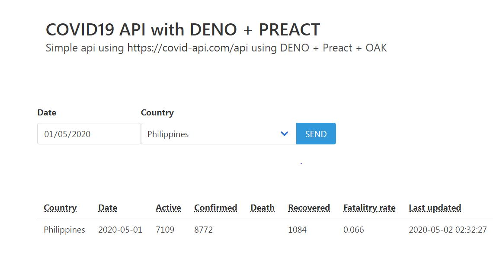

# DENO server api calls with client using oak/server

---

# Overview

A simple Covid19 app using https://covid-api.com/api with DENO as server and client in Preact.

# Prerequisite

The app is running in Windows environment so here is my setup for windows user, for mac and linux user, you can use `homebrew` instead of `choco`

- Install Chocolately (https://chocolatey.org/install)
- Install deno using choco

  `$ choco install deno`

- Install `make` to run your deno runnable with shortcut like `npm start`

  `$ choco make`

- _(optional)_ Install denon on deno - (works like nodemon for hot-reloading)

  `$ deno install -Af --unstable https://deno.land/x/denon/denon.ts`

# Usage

| Tables       |              Are               |
| ------------ | :----------------------------: |
| `make run`   | run deno server and other args |
| `make test`  |         run deno test          |
| `make debug` |           run debug            |
| `denon`      |    run deno with hot reload    |
